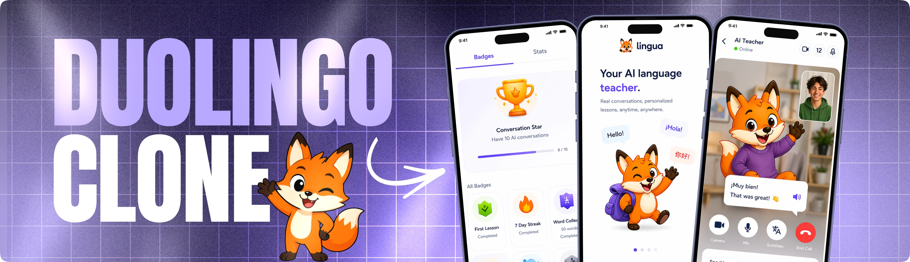

<div align="center">
  <br />
    <a href="https://github.com/Faqih001/kiibridge-lingua-app" target="_blank">
      
    </a>
  <br />

  <div>
    
    
    
    
    <br />
    
    
    
    
  </div>

  <h3 align="center">KiiBridge Lingua | AI-Powered Language Learning Platform</h3>

  <div align="center">
    Learn languages through real-time AI conversations, interactive lessons, personalized learning paths, and immersive voice-based practice experiences.
  </div>
</div>

## 📋 Table of Contents

1. ✨ Introduction
2. ⚙️ Tech Stack
3. 🔋 Features
4. 🤸 Quick Start
5. 🚀 Deployment
6. 📱 App Structure
7. 🔗 Assets & Resources

---

## ✨ Introduction

KiiBridge Lingua is a modern AI-powered language learning mobile application built to help learners improve speaking, listening, reading, and conversational skills through interactive lessons and real-time AI tutoring.

The platform combines conversational AI, voice interactions, adaptive learning paths, and personalized practice sessions to create an immersive language-learning experience. Users can engage with an AI teacher, practice real-world conversations, track progress, and improve fluency at their own pace.

Built using React Native, Expo, Clerk, Stream, OpenAI technologies, and modern mobile development tools, KiiBridge Lingua delivers a scalable and engaging language-learning experience across iOS and Android devices.

---

## ⚙️ Tech Stack

- **React Native** — Cross-platform mobile framework for building native Android and iOS applications from a single codebase.
- **Expo** — Development platform that simplifies building, testing, and deploying React Native applications.
- **TypeScript** — Strongly typed language that improves code quality, maintainability, and developer productivity.
- **NativeWind** — Utility-first styling framework for creating responsive and consistent mobile user interfaces.
- **Zustand** — Lightweight state management solution for handling application-wide state efficiently.
- **Clerk** — Authentication and user management platform supporting secure login, registration, and account management.
- **Stream** — Real-time communication infrastructure powering AI voice interactions and conversational experiences.
- **OpenAI** — AI engine responsible for conversational tutoring, language assistance, pronunciation support, and learning guidance.
- **PostHog** — Analytics platform used to monitor engagement, learning behavior, and application performance.

---

## 🔋 Features

### 🌍 Multi-Language Learning

Support for learning multiple languages through structured lessons and conversational practice.

### 👋 Personalized Onboarding

Guided onboarding process allowing users to select:

- Preferred language
- Learning goals
- Proficiency level
- Daily learning targets

### 🔐 Secure Authentication

User registration, login, profile management, and account security powered by Clerk.

### 🎙️ Real-Time AI Language Teacher

Practice conversations naturally with an AI-powered tutor capable of listening, responding, and guiding language learning.

### 🗣️ Voice-Based Learning

Interactive speaking exercises and pronunciation coaching through real-time voice communication.

### 📚 Interactive Lessons

Structured learning modules covering:

- Vocabulary
- Grammar
- Listening
- Speaking
- Reading comprehension
- Practical conversations

### 🎯 Adaptive Learning Paths

Personalized learning recommendations based on user performance, goals, and progress.

### 📊 Learning Analytics

Track:

- Lesson completion
- Language proficiency growth
- Learning streaks
- Speaking performance
- Practice statistics

### 🔔 Progress Tracking

Monitor milestones, achievements, and language-learning goals.

### 🎮 Gamified Learning Experience

Encourage engagement through rewards, badges, streaks, and progress indicators.

### 📱 Mobile-First Design

Optimized user experience across Android and iOS devices.

---

## 🤸 Quick Start

### Prerequisites

Ensure the following are installed:

- Git
- Node.js
- npm
- Expo CLI (optional)

---

### Clone the Repository

```bash
git clone https://github.com/Faqih001/kiibridge-lingua-app.git
cd kiibridge-lingua-app
```

---

### Install Dependencies

```bash
npm install
```

---

### Configure Environment Variables

Create a `.env` file in the project root:

```env
# Clerk Authentication
EXPO_PUBLIC_CLERK_PUBLISHABLE_KEY=

# Analytics
POSTHOG_PROJECT_TOKEN=
POSTHOG_HOST=

# Stream Voice Services
STREAM_API_KEY=
STREAM_API_SECRET=

# AI Services
OPENAI_API_KEY=

# Vision Agent (Optional)
VISION_AGENT_URL=http://localhost:8000
```

Replace the placeholders with your service credentials.

---

### Start Development Server

```bash
npx expo start
```

---

### Run on Devices

Use Expo commands:

```text
a → Android Emulator
i → iOS Simulator
w → Web Browser
r → Reload Application
m → Open Developer Menu
```

Alternatively, install **Expo Go** from the App Store or Google Play Store and scan the QR code displayed in the terminal.

---

## 🚀 How It Works

### 1. Create an Account

Register and set up your learner profile.

### 2. Select Learning Preferences

Choose:

- Language to learn
- Current proficiency level
- Learning objectives
- Daily targets

### 3. Start Lessons

Complete interactive lessons covering vocabulary, grammar, and communication skills.

### 4. Practice with AI

Engage in real-time voice conversations with the AI tutor.

### 5. Receive Feedback

Get personalized guidance on:

- Pronunciation
- Grammar
- Vocabulary usage
- Conversation fluency

### 6. Track Progress

Monitor learning achievements and language development through analytics dashboards.

### 7. Continue Improving

Follow personalized recommendations and adaptive learning pathways.

---

## 📱 App Structure

```text
.
├── app/
│   ├── onboarding/
│   ├── auth/
│   ├── lessons/
│   ├── practice/
│   ├── profile/
│   └── settings/
│
├── components/
│   ├── lessons/
│   ├── practice/
│   ├── analytics/
│   └── ui/
│
├── services/
│   ├── ai/
│   ├── stream/
│   └── analytics/
│
├── store/
│
├── hooks/
│
├── assets/
│
├── utils/
│
└── types/
```

---

## 🚀 Deployment

### Android Build

```bash
eas build --platform android
```

### iOS Build

```bash
eas build --platform ios
```

### Production Deployment

```bash
eas submit
```

Ensure:

- Clerk is configured.
- Stream services are connected.
- OpenAI API credentials are active.
- Analytics integrations are enabled.

---

## 🔗 Assets & Resources

Recommended project directories:

```text
/assets
/public
/docs
```

Documentation:

```text
README.md
/docs
```

Language resources:

```text
/assets/languages
/assets/audio
/assets/lessons
```

---

## 🚀 Future Enhancements

- AI pronunciation scoring
- Video conversation practice
- Language placement tests
- Offline learning mode
- Community learning groups
- Live tutor integration
- Language certification preparation
- Multi-device synchronization
- Advanced learning analytics
- Classroom and institution support
- AI-generated lesson creation
- Language exchange matching

---

## 📄 License

This project is maintained under the applicable license specified within the repository.

---

<div align="center">
  <strong>KiiBridge Lingua</strong><br/>
  Empowering language learners through AI-driven conversations, personalized learning, and immersive mobile experiences.
</div>